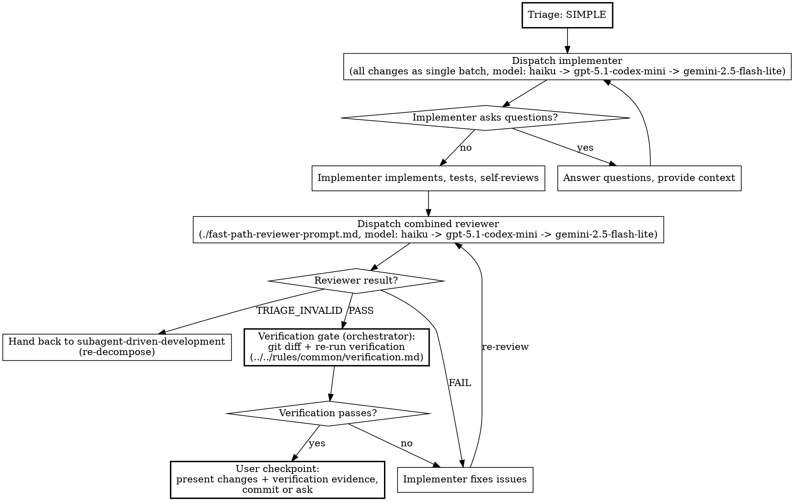

# Fast Path Implementation

When `complexity-triage` has classified the work as SIMPLE with full evidence, implementation collapses to two subagent dispatches plus a user checkpoint. This skill covers that shortened process. The iron-law rules on subagent dispatch (context isolation, git ownership, worktree ban, privilege ban) live in `../../rules/common/subagents.md`. The procedural rules (subagent type selection, model selection, escalation) live in `../_shared/subagent-dispatch.md` and apply throughout.

Before running the procedure below, you **MUST** read `../_shared/subagent-dispatch.md` using the Read tool if you have not already read it in this session.

## Precondition

You **MUST NOT** enter this skill without a SIMPLE classification from `complexity-triage` that has been presented to the user. If you have not run triage, run it first. If triage returned COMPLEX, use `subagent-driven-development` instead.

The caller of this skill is responsible for having asked the commit preference question before arriving here.

## Process

### 1. Single Implementation Dispatch

Dispatch one implementer with every change as a single batch. Use `../subagent-driven-development/implementer-prompt.md` with the task description covering the full scope of changes. Select the specialised subagent type for the work per `../../rules/common/subagents.md`. Pick one concrete model: use `model: "haiku"`; if it is unavailable, use `model: "gpt-5.1-codex-mini"`; if that is unavailable and Google models are exposed, use `model: "gemini-2.5-flash-lite"`. If the work is simple enough for this path, it is simple enough for the cheapest model.

### 2. Single Combined Review

Dispatch one reviewer that checks spec compliance and code quality in a single pass, using `./fast-path-reviewer-prompt.md`. This is not a weaker review than the full path. It covers the same ground; the combination is possible because the small scope makes separation unnecessary overhead. Pick one concrete model: use `model: "haiku"`; if it is unavailable, use `model: "gpt-5.1-codex-mini"`; if that is unavailable and Google models are exposed, use `model: "gemini-2.5-flash-lite"`.

The reviewer returns one of three outcomes:

- **PASS**: proceed to the user checkpoint
- **FAIL**: re-dispatch the implementer with the review issues as fix instructions, then re-review. Repeat until PASS.
- **TRIAGE_INVALID**: the reviewer judges the work is more complex than the triage concluded. Stop the fast path, reclassify as COMPLEX, and hand back to `subagent-driven-development` for re-decomposition.

### 3. Verification Gate

After the reviewer approves and **before** the user checkpoint, run the verification gate against the implementer's work yourself. This is the same gate as the per-task pipeline in `../subagent-driven-development/SKILL.md` and is required by `../../rules/common/verification.md`. Even on the fast path, "the reviewer said it was fine" is not a substitute for running the verification yourself.

1. **Inspect the diff yourself.** Run `git status` and `git diff`. Confirm the files changed match the spec and nothing else changed.
2. **Confirm the implementer's TDD evidence.** Per `../subagent-driven-development/implementer-prompt.md`, the implementer report includes RED to GREEN evidence for each new behaviour. If the SIMPLE work introduced new behaviour (rare on the fast path; pure string replacements do not), the evidence **MUST** be present.
3. **Re-run the verification commands yourself.** Run the project's standard test command, the linter, and the build (or whatever the design's acceptance criteria called out), in this message, against the current working tree.
4. **Read the output.** Capture exit codes and pass/fail counts.
5. **Compare to the spec.** If any check fails, re-dispatch the implementer with the failure as fix instructions, then re-run the gate.

The verification evidence (commands, exit codes, pass/fail counts) is shown to the user as part of the user checkpoint.

### 4. User Checkpoint

Present the changes to the user:

1. Summarise what was implemented and what the reviewer found
2. Cite the verification evidence: commands run, exit codes, pass/fail counts
3. Show a `git diff` of the uncommitted changes
4. If the user chose "ask me each time" at the commit-preference question, ask whether to commit via `{{ASK_USER_QUESTION_TOOL}}` (options: "Commit", "Adjust first", "Skip commit"). If the user chose auto-commit, commit immediately after presenting the summary.

## Process Flow



## Worked Example

```
You: I'm implementing the design for updating copyright headers across the codebase.

[Orchestrator has already asked commit preference]
User chose: Auto-commit after each task

[Run complexity-triage, classification returns SIMPLE with evidence table]

[Dispatch single implementer (model: haiku; fallback gpt-5.1-codex-mini, then gemini-2.5-flash-lite) with all 8 files as one batch]

Implementer:
  - Updated copyright year in all 8 files
  - Self-review: all changes are consistent string replacements

[Dispatch combined reviewer (model: haiku; fallback gpt-5.1-codex-mini, then gemini-2.5-flash-lite)]

Combined reviewer: [PASS] All 8 files correctly updated. Changes match spec exactly,
no extra modifications, consistent with surrounding code style.

[Verification gate: orchestrator runs git diff + standard verification itself]
$ git diff --stat
 8 files changed, 8 insertions(+), 8 deletions(-)
$ npm test
PASS (78 tests, 78 passed)
$ npm run lint
exit 0

[Verification PASSES]

[Present diff + verification evidence to user]
Here are the changes: 8 files with updated copyright headers.
Verification: 78/78 tests passing, lint exit 0.

[Auto-commit: user chose auto-commit at start]

Done.
```

## Prompt Templates

- `../subagent-driven-development/implementer-prompt.md`: the implementer prompt (shared with the full path)
- `./fast-path-reviewer-prompt.md`: the combined reviewer prompt specific to the fast path
