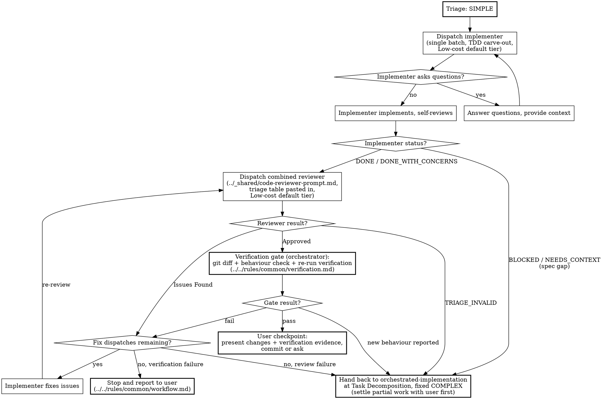

# Fast Path Implementation

When `complexity-triage` has classified the work as SIMPLE with full evidence, implementation collapses to two subagent dispatches plus a user checkpoint. This skill covers that shortened process. The iron-law rules on subagent dispatch (context isolation, git ownership, worktree ban, privilege ban) live in `../../rules/common/subagents.md`. The procedural rules (model selection, escalation) live in `../_shared/subagent-dispatch.md` and apply throughout.

Before running the procedure below, you **MUST** read `../_shared/subagent-dispatch.md` using the Read tool if you have not already read it in this session.

## Precondition

You **MUST NOT** enter this skill without two things: a SIMPLE classification from `complexity-triage` that has been presented to the user, and a caller that has already asked the commit-preference question.

Both belong to the orchestrator rather than to this skill. `complexity-triage` runs inside `orchestrated-implementation`'s Triage and Path Selection step, never before it; the commit preference is asked once at the start of the orchestrating session and holds for its duration. So an invocation arriving here without them has not skipped a step in this skill, it has skipped the skill that owns those steps. Hand the design to `orchestrated-implementation` and stop. That skill runs triage and reaches this one on its own if the verdict is SIMPLE, and if the verdict is COMPLEX, this skill was never the destination.

The one exception is a user who overrides a COMPLEX verdict, which the Return Contract in `../complexity-triage/SKILL.md` permits because the user outranks the skill. In that case the evidence table arrives with its failing rows intact and you pass it on unaltered, so the reviewer below can weigh the overridden criterion against the real diff.

## Process

### 1. Single Implementation Dispatch

Dispatch one implementer with every change as a single batch, using `../_shared/implementer-prompt.md` with a task description covering the full scope of changes. Pick one concrete model at the Low-cost default tier, resolved per `../_shared/subagent-dispatch.md`. If the work is simple enough for this path, it is simple enough for the cheapest model.

#### Adapting the Shared Prompt

That prompt was written for the full path, where every task carries new behaviour: it requires invoking the `test-driven-development` skill for each one, and states its exception mechanism in its own Exceptions section. None of that applies here, because `complexity-triage` criterion 2 means SIMPLE work introduces no new behaviour, and behaviour that does not exist has nothing for a test to cover.

Dispatched unadapted, the prompt sets the implementer against the path it is running on. It will invoke `test-driven-development` over a string replacement, which is the YAGNI violation the reviewer then has to catch, or report `DONE_WITH_CONCERNS` over evidence that was never going to exist. The carve-out is the orchestrator's job and has to be written into the dispatch.

Two additions to the task description, every time:

1. **Carve out the exception explicitly.** State that the work was triaged SIMPLE, that criterion 2 means no observable behaviour, so the implementer must NOT invoke `test-driven-development`; the existing suite must stay green throughout. That is the prompt's own exception, named in the terms it recognises.

2. **Ask for an affirmative statement about behaviour.** Require the report to say, in place of RED to GREEN evidence, whether any change introduced observable behaviour, and to name it if so. The gate in step 3 turns on that sentence. An implementer reporting new behaviour has falsified the triage, and an implementer never asked has no reason to mention the absence of something.

### 2. Single Combined Review

Dispatch one reviewer that checks spec compliance and code quality in a single pass, using `../_shared/code-reviewer-prompt.md`. This call site fills the Triage Re-Check block, not the Scope block. This is not a weaker review than the full path. It covers the same ground; the combination is possible because the small scope makes separation unnecessary overhead. Pick one concrete model at the Low-cost default tier, resolved per `../_shared/subagent-dispatch.md`.

Paste the triage evidence table into the dispatch. The prompt asks for it by name, because re-checking the classification against the real diff is the reviewer's first job, and on a user-overridden verdict the failing rows are the specific thing it needs to weigh.

The reviewer returns one of three outcomes:

- **Approved**: proceed to the verification gate in step 3, which comes before the user checkpoint. An Approved verdict carrying only Minor findings still counts as Approved and does not consume the fix budget below.
- **Issues Found**: re-dispatch the implementer with the review issues as fix instructions, then re-review, within the budget below. Only Critical and Important findings drive a fix dispatch; a Minor finding is deferred to the user checkpoint instead.
- **TRIAGE_INVALID**: the reviewer judges the work more complex than the triage concluded. End the fast path per the Return Contract.

#### The Fix Budget

Fixes get two dispatches in total, counted across this review and the verification gate in step 3, and spent only on Critical and Important findings. When the second dispatch still returns Issues Found, stop rather than dispatching a third.

That is not an arbitrary counter, and it is not the escalation ladder in `../_shared/subagent-dispatch.md` either. Escalating the model is the right response when a task outruns its tier, but this task was certified as fully specified with no room for interpretation. Work a reviewer rejects twice was not, whatever criterion 4's row said, so the fault is in the classification rather than in the implementer. A more capable model would produce a more convincing implementation of an under-specified spec, which is precisely what this path has no per-task checkpoints left to catch.

Where the budget runs out decides the exit. A review that will not pass is `TRIAGE_INVALID`, because criterion 4 has been falsified by demonstration. A verification failure that will not clear is a stopping condition under `../../rules/common/workflow.md`, because a failing suite is a fact about the code rather than a verdict on the classification. Both are covered in the Return Contract.

### 3. Verification Gate

After the reviewer approves and **before** the user checkpoint, run the verification gate against the implementer's work yourself. This is the same gate as the per-task pipeline in `../orchestrated-implementation/SKILL.md` and is required by `../../rules/common/verification.md`. Even on the fast path, "the reviewer said it was fine" is not a substitute for running the verification yourself.

1. **Inspect the diff yourself.** Run `git status` and `git diff`. Confirm the files changed match the spec and nothing else changed.

2. **Read the implementer's report for new behaviour.** Step 1 required the report to state this outright, so read for the statement rather than inferring from its absence. A report claiming new behaviour has shown the triage was wrong regardless of what the table said, which is a `TRIAGE_INVALID` condition: end the fast path rather than asking for a test after the fact. A report silent on the question is not a clearance either, it is a missing piece of the report, and it gets re-dispatched for the same reason the full path re-dispatches for missing TDD evidence.

3. **Re-run the verification commands yourself.** Run whatever the design's acceptance criteria called out, in this message, against the current working tree. Where the criteria named nothing, run the project's standard test command, the linter and the build.

   A documentation-only or configuration-only batch may have no command that exercises what changed. That is a claim about the project, not a licence to skip the step, so check it and then say what you ran instead: a linter, a schema validation, a parse or render of the changed files, a link check. `../../rules/common/verification.md` demands evidence rather than one specific command, and "there was nothing to run" is only evidence once you have looked.

4. **Read the output.** Capture exit codes and pass/fail counts.

5. **Compare to the spec.** If any check fails, re-dispatch the implementer with the failure as fix instructions, drawing on the fix budget in step 2, then re-run the gate. Every fix re-enters at the review in step 2 first: unreviewed code must never reach this gate.

The verification evidence (commands, exit codes, pass/fail counts) is shown to the user as part of the user checkpoint.

### 4. User Checkpoint

Present the changes to the user:

1. Summarise what was implemented and what the reviewer found
2. Cite the verification evidence: commands run, exit codes, pass/fail counts
3. Show a `git diff` of the uncommitted changes
4. If the user chose "ask me each time" at the commit-preference question, ask whether to commit via `AskUserQuestion` (options: "Commit", "Adjust first", "Skip commit"). If the user chose auto-commit, commit immediately after presenting the summary.

#### Why There Is No Feature-Level Review

`../orchestrated-implementation/SKILL.md` closes with a feature-level review through `requesting-code-review` and a final `verification-before-completion` pass. It needs them because its per-task reviewers each saw one task, so nobody had read the feature whole, and inconsistent naming, drifting interfaces and integration gaps only appear across task boundaries.

That gap does not exist here. Triage runs once against the entire design, this path implements it as a single batch, and the combined reviewer reads the whole cumulative diff in one pass. A feature-level review would be the same reviewer reading the same diff a second time.

The obligations are discharged rather than waived. The combined review in step 2 is the production-readiness review `../../rules/common/code-review.md` requires before handing work back as complete; the gate in step 3 is the fresh evidence `../../rules/common/verification.md` requires, produced by the orchestrator in the message that makes the claim. Do not dispatch a second reviewer here. If the diff turns out large enough that one reviewer reading it whole feels thin, that is criterion 6 failing after the fact, and the response is `TRIAGE_INVALID` rather than more review.

## Handling Implementer Status

Implementers report one of the four statuses defined in `../_shared/implementer-prompt.md`. Two of them read differently here, because the classification makes a claim about the work that the status contradicts.

| Status               | Response                                                                                                                                                                                                                        |
|----------------------|---------------------------------------------------------------------------------------------------------------------------------------------------------------------------------------------------------------------------------|
| `DONE`               | Proceed to the combined review.                                                                                                                                                                                                 |
| `DONE_WITH_CONCERNS` | Read the concerns. A concern about correctness or scope goes into the reviewer's dispatch as something to check; an observation is noted and carried to the checkpoint. Either way, proceed to the review.                      |
| `NEEDS_CONTEXT`      | `TRIAGE_INVALID`, when what is missing is a spec or design detail. Answer and re-dispatch only when what is missing is environmental (a path, a command name, where a credential lives) and the specification itself is intact. |
| `BLOCKED`            | `TRIAGE_INVALID`, unless the blocker is environmental (a command needing elevated privilege, a missing tool), which goes to the user per `../../rules/common/subagents.md`.                                                     |

On the full path, `NEEDS_CONTEXT` and `BLOCKED` mean supply more context, escalate the model, or split the task, and `../_shared/subagent-dispatch.md` lists exactly those responses. Here the same words carry a narrower meaning. Criterion 4 certified that the correct change at each location was fully specified with no room for interpretation, so an implementer that cannot proceed from the specification has falsified that criterion by trying. Supplying the missing decision would settle the case in front of you and leave the classification wrong, and the classification is what removed the per-task checkpoints that would have caught the next one.

A question asked before work starts is not a status and is not covered by this. `../_shared/implementer-prompt.md` invites those explicitly, and `../_shared/subagent-dispatch.md` requires answering them completely before the implementer proceeds. What separates them is whether the implementer stopped: a clarifying question is answered and the dispatch continues, a `NEEDS_CONTEXT` report is an attempt that ended.

## Return Contract

This section is addressed to whichever skill invoked this one. It lives here rather than being restated in each caller because invoking this skill is what loads the file, so the caller holds the text at the moment it needs it.

**Complete.** The reviewer passed, the gate passed, and the user checkpoint has been held. The caller receives the summary, the verification evidence, and the commit SHA if a commit was made. Nothing further is owed. This path holds no task board, runs no feature-level review, and terminates the implementation of the design it was handed, so the caller reports completion and stops.

**Commit declined.** The user chose "Skip commit" or "Adjust first" at the checkpoint. The work sits in the tree, reviewed and verified and uncommitted, and the caller receives that state along with whatever the user said. It does nothing to the tree. What makes this different from the same answer on the full path is that there is no next task to move on to, so the caller's next act is the user's to choose and it asks rather than assumes.

**TRIAGE_INVALID.** The classification has been falsified: by the reviewer, by the implementer's report of new behaviour, by a `BLOCKED` or `NEEDS_CONTEXT` status, by a review that would not pass inside the fix budget, or by the orchestrator seeing it directly. The caller receives the criterion that failed and the evidence for it, then re-enters `../orchestrated-implementation/SKILL.md` at **Task Decomposition** with the classification fixed at COMPLEX.

Two of that skill's earlier steps are skipped on re-entry, and skipping them is deliberate:

- **The commit preference** was asked once at the start of the session and holds for its duration. Asking again reopens a settled question.
- **`complexity-triage` is not re-run.** Its Preconditions bind triage to once per design, and re-running it here would feed the same design through the same predictive evidence and return the same SIMPLE verdict, reopening the path that just failed. The falsification is the verdict now, and it is the stronger one: it came from reading code that exists, which is the evidence triage never had.

**The partial work needs a decision before decomposition starts.** The implementer's edits are uncommitted in the working tree, and decomposition is about to plan tasks against that tree. Three things can happen to them and only one of the three is yours: keeping them means the first task's diff contains work no task specified; discarding them means `git restore` or `git checkout` against tracked files, which `../../rules/common/git.md` forbids without explicit permission for that exact action; committing them means committing work just declared misclassified. Put it to the user with `AskUserQuestion` (options: "Keep the changes and decompose around them", "Discard the changes and start clean", "Show me the diff first") before handing back. `../complexity-triage/SKILL.md` calls the sunk cost negligible and it is, but a negligible cost is still a decision.

**Stopped.** A verification failure survived the fix budget, or a blocker needs a person: elevated privilege, a missing tool, a failing dependency. The caller receives the failure output, the current diff, and what was tried. It **MUST NOT** re-invoke this skill against the same design, and **MUST NOT** patch the failure itself, because `../_shared/subagent-dispatch.md` forbids the orchestrator repairing a subagent's output by hand and `../../rules/common/workflow.md` makes a verification failure that implicates the plan a stopping condition. It stops and puts the failure to the user.

## Process Flow


```dot
digraph fast_path {
    rankdir=TB;

    "Triage: SIMPLE" [shape=box, style=bold];
    "Dispatch implementer\n(single batch, TDD carve-out,\nLow-cost default tier)" [shape=box];
    "Implementer asks questions?" [shape=diamond];
    "Answer questions, provide context" [shape=box];
    "Implementer implements, self-reviews" [shape=box];
    "Implementer status?" [shape=diamond];
    "Dispatch combined reviewer\n(../_shared/code-reviewer-prompt.md,\ntriage table pasted in,\nLow-cost default tier)" [shape=box];
    "Reviewer result?" [shape=diamond];
    "Fix dispatches remaining?" [shape=diamond];
    "Implementer fixes issues" [shape=box];
    "Verification gate (orchestrator):\ngit diff + behaviour check + re-run verification\n(../../rules/common/verification.md)" [shape=box, style=bold];
    "Gate result?" [shape=diamond];
    "Hand back to orchestrated-implementation\nat Task Decomposition, fixed COMPLEX\n(settle partial work with user first)" [shape=box, style=bold];
    "Stop and report to user\n(../../rules/common/workflow.md)" [shape=box, style=bold];
    "User checkpoint:\npresent changes + verification evidence,\ncommit or ask" [shape=box, style=bold];

    "Triage: SIMPLE" -> "Dispatch implementer\n(single batch, TDD carve-out,\nLow-cost default tier)";
    "Dispatch implementer\n(single batch, TDD carve-out,\nLow-cost default tier)" -> "Implementer asks questions?";
    "Implementer asks questions?" -> "Answer questions, provide context" [label="yes"];
    "Answer questions, provide context" -> "Dispatch implementer\n(single batch, TDD carve-out,\nLow-cost default tier)";
    "Implementer asks questions?" -> "Implementer implements, self-reviews" [label="no"];
    "Implementer implements, self-reviews" -> "Implementer status?";
    "Implementer status?" -> "Dispatch combined reviewer\n(../_shared/code-reviewer-prompt.md,\ntriage table pasted in,\nLow-cost default tier)" [label="DONE / DONE_WITH_CONCERNS"];
    "Implementer status?" -> "Hand back to orchestrated-implementation\nat Task Decomposition, fixed COMPLEX\n(settle partial work with user first)" [label="BLOCKED / NEEDS_CONTEXT\n(spec gap)"];
    "Dispatch combined reviewer\n(../_shared/code-reviewer-prompt.md,\ntriage table pasted in,\nLow-cost default tier)" -> "Reviewer result?";
    "Reviewer result?" -> "Verification gate (orchestrator):\ngit diff + behaviour check + re-run verification\n(../../rules/common/verification.md)" [label="Approved"];
    "Reviewer result?" -> "Fix dispatches remaining?" [label="Issues Found"];
    "Reviewer result?" -> "Hand back to orchestrated-implementation\nat Task Decomposition, fixed COMPLEX\n(settle partial work with user first)" [label="TRIAGE_INVALID"];
    "Fix dispatches remaining?" -> "Implementer fixes issues" [label="yes"];
    "Fix dispatches remaining?" -> "Hand back to orchestrated-implementation\nat Task Decomposition, fixed COMPLEX\n(settle partial work with user first)" [label="no, review failure"];
    "Fix dispatches remaining?" -> "Stop and report to user\n(../../rules/common/workflow.md)" [label="no, verification failure"];
    "Implementer fixes issues" -> "Dispatch combined reviewer\n(../_shared/code-reviewer-prompt.md,\ntriage table pasted in,\nLow-cost default tier)" [label="re-review"];
    "Verification gate (orchestrator):\ngit diff + behaviour check + re-run verification\n(../../rules/common/verification.md)" -> "Gate result?";
    "Gate result?" -> "Fix dispatches remaining?" [label="fail"];
    "Gate result?" -> "Hand back to orchestrated-implementation\nat Task Decomposition, fixed COMPLEX\n(settle partial work with user first)" [label="new behaviour reported"];
    "Gate result?" -> "User checkpoint:\npresent changes + verification evidence,\ncommit or ask" [label="pass"];
}
```

## Worked Example

```
You: I'm implementing the design for updating copyright headers across the codebase.

[Orchestrator has already asked commit preference]
User chose: Auto-commit after each task

[Run complexity-triage, classification returns SIMPLE with evidence table]

[Dispatch single implementer (Low-cost default tier) with all 8 files as one batch.
 Task description carries the TDD carve-out: triaged SIMPLE, criterion 2 means no
 observable behaviour, no new test expected, existing suite must stay green. It also
 asks the report to state outright whether any change introduced behaviour.]

Implementer:
  - Updated copyright year in all 8 files
  - Behaviour: none introduced; every change is a header comment string
  - Existing suite green: 78/78
  - Self-review: all changes are consistent string replacements

[Dispatch combined reviewer (Low-cost default tier), triage table pasted into the prompt]

Combined reviewer: Approved. Triage holds: git diff --stat shows 8 substantive lines
against criterion 6's cap of 50. All 8 files correctly updated, no extra modifications,
consistent with surrounding code style. No new tests, which is correct on this path.

[Verification gate: orchestrator runs git diff + standard verification itself]
$ git diff --stat
 8 files changed, 8 insertions(+), 8 deletions(-)
$ npm test
PASS (78 tests, 78 passed)
$ npm run lint
exit 0

[Implementer's report states no new behaviour. Gate PASSES]

[Present diff + verification evidence to user]
Here are the changes: 8 files with updated copyright headers.
Verification: 78/78 tests passing, lint exit 0.

[Auto-commit: user chose auto-commit at start]

Done. Returning Complete to the caller with the commit SHA.
```

## Red Flags

Every thought below means stop:

- "The reviewer approved it, so the gate is a formality." The gate is the orchestrator's own evidence, and `../../rules/common/verification.md` does not accept a subagent's report in its place.
- "It is only a string replacement, the suite does not need running." The size of a change is not evidence about the suite. Run it.
- "One more fix round and it will pass." The budget is spent because two rounds have already said otherwise.
- "I will just fix this one myself, it is a single line." Repairing a subagent's output in the orchestrator context is forbidden by `../_shared/subagent-dispatch.md`, and the line count is not why.
- "The implementer added a test, which is thorough of it." On this path a new test means new behaviour, which means the triage was wrong.
- "It is faster to answer the implementer's blocker than to hand back." Faster now, and the classification stays wrong for every remaining change in the batch.

## Common Mistakes

| Mistake                                                                  | Why it is wrong                                                                                                                                                                                                                                |
|--------------------------------------------------------------------------|------------------------------------------------------------------------------------------------------------------------------------------------------------------------------------------------------------------------------------------------|
| Dispatching `../_shared/implementer-prompt.md` without the TDD carve-out | The prompt requires invoking `test-driven-development` for every new behaviour. Unadapted, the implementer invokes it over a string replacement with no behaviour to cover, producing invented tests, or reports a false `DONE_WITH_CONCERNS`. |
| Handing back to `orchestrated-implementation` at the top                 | Re-entry at step 2 re-runs triage, which feeds the same design through the same predictive evidence and returns SIMPLE again, reopening the path that just failed. Re-enter at Task Decomposition.                                             |
| Discarding the implementer's partial work on handback without asking     | `../../rules/common/git.md` forbids `git restore` and `git checkout` against tracked files without explicit permission for that exact action. The cost is negligible; the decision is still the user's.                                        |
| Escalating the model after a review returns Issues Found                 | The tier was never the constraint. Criterion 4 said the spec left no room for interpretation and two rejections say it did. A better model implements the ambiguity more convincingly.                                                         |
| Dispatching `requesting-code-review` after the checkpoint                | The combined reviewer already read the whole cumulative diff, because the whole design was one batch. A second reviewer reads the same diff again.                                                                                             |
| Reading a report that is silent on behaviour as "no new behaviour"       | Step 1 asks for the statement outright so that its absence is a gap rather than an inference. Re-dispatch for it.                                                                                                                              |
| Asking the commit preference here                                        | The caller owns it and asked it once for the session. An invocation reaching here without it should have gone to `orchestrated-implementation`.                                                                                                |
| Skipping verification because nothing executable changed                 | "There was nothing to run" is a claim about the project that has to be checked. Check it, then cite what you ran in place of the suite.                                                                                                        |

## Prompt Templates

- `../_shared/implementer-prompt.md`: the implementer prompt (shared with the full path, adapted per step 1)
- `../_shared/code-reviewer-prompt.md`: the reviewer prompt, shared with the other two call sites; this one fills its Triage Re-Check block

## Integration

- **complexity-triage**: the precondition. Returns SIMPLE with the evidence table this skill passes to its reviewer.
- **orchestrated-implementation**: the caller, and the destination for a `TRIAGE_INVALID` handback at its Task Decomposition step.
