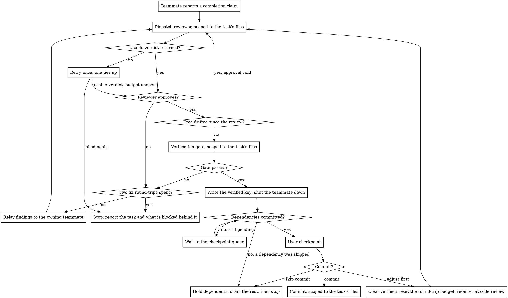

# Orchestrated Implementation

The iron laws that bind every teammate and every coordination step live in `../../rules/common/teammates.md`, with the universal laws shared with one-shot subagents in Part A of `../../rules/common/subagents.md`. Both are always in context and need no read. The procedural rules for constructing a dispatch (agent type, model selection, parallel dispatch, escalation) live in `../_shared/subagent-dispatch.md`. The rule that implementation requires an approved design lives in `../../rules/common/workflow.md`.

Before running the procedure below, read `../_shared/subagent-dispatch.md` with the Read tool if you have not already read it this session. Read `./teammate-protocol.md` before spawning any teammate: it holds the mailbox contract, the completion handoff, idle handling and failure recovery, and a lead that reaches Spawn and Assign without it is coordinating from memory.

## When to Run

You need an approved design, from the `brainstorming` router via any of its modes, from `work-on-ticket`, or from a committed specification. If the design is incomplete, return to brainstorming rather than running this skill: decomposition cannot invent requirements the design never settled.

Coupled and strictly ordered work runs here too. Order is expressed as `blockedBy` edges between tasks, not as a reason to look for a different skill.

## Process Overview

1. Check both capability preconditions
2. Ask the commit preference, once
3. Run `complexity-triage`, and hand off to `fast-path-implementation` on a SIMPLE verdict
4. Decompose the design into tasks and create the board
5. Run the pre-flight ownership check over the whole decomposition
6. Spawn teammates up to the ready count and assign their tasks
7. On each completion claim, run code review, then the verification gate
8. Drain verified tasks through the user checkpoint, one at a time, in board order
9. Confirm every teammate is shut down, run the final feature-level review, report completion

## Capability Gate

Two preconditions. Check both here, before anything else, and check nothing that spawns or writes. Read the Capability Probe in `../_shared/task-board.md` first, because it defines the board check below.

- **The task board.** Confirm `TaskCreate` is available, per that probe, which also states why there is no flat-checklist fallback.
- **Teammates.** Confirm `SendMessage` and `TaskStop` are in the tool list. Reading the list is the whole check; do not spawn to find out.

Record which precondition failed and carry it into Triage and Path Selection below, which is the only step that can tell whether the missing capability is needed for the path the work is taking. Name it when you report it: "the board tooling is unavailable" and "the teammate capability is not enabled" are different problems with different remedies, and `../../rules/common/errors.md` requires the remedy to be actionable. State what was attempted, what is missing, and that nothing has been written to the board or the tree.

A failed precondition never licenses a flat checklist, a solo implementation, or any other substitute way of working.

## Commit Preference

Ask the user once, with `AskUserQuestion`, how commits should be handled. The choice is session-wide and covers every task, including a hand-off to `fast-path-implementation`.

- **Auto-commit after each task**: each verified task is committed as it drains, in board order. The user sees a summary, the scoped diff and the verification evidence for each, and is not asked to confirm.
- **Ask me each time**: each verified task waits for the user's answer before it commits. Teammates keep working while it waits, so more than one task may be queued behind the question.

State the consequence inside the option text, as above.

## Triage and Path Selection

Run `complexity-triage` against the approved design. That skill presents its own evidence table and defines what it returns; do not present the table again, and do not re-run triage against the tasks the next section produces.

- **SIMPLE, both preconditions passed.** Invoke `fast-path-implementation`, passing the evidence table through and noting the override if the SIMPLE verdict came from the user rather than the criteria. Then branch on its Return Contract: **Complete** ends the run with its report; **Commit declined** leaves reviewed, uncommitted work in the tree, so put the next step to the user rather than assuming one; **Stopped** surfaces the failure output and the diff it returned; **TRIAGE_INVALID** re-enters below.
- **SIMPLE, a precondition failed.** The fast path holds no task board and spawns no teammate, so it can still complete. Say so before dispatching anything: name the missing capability, say that reclassification would need it, and let the user choose whether to proceed on that basis. If they decline, stop: name the missing capability and state that nothing has been written to the board or the tree.
- **COMPLEX, both preconditions passed.** Continue to Task Decomposition below.
- **COMPLEX, a precondition failed.** Stop, with nothing written to the board and nothing in the tree.

### Re-Entry After The Fast Path Hands Back

`fast-path-implementation` returns `TRIAGE_INVALID` when the actual code falsifies the SIMPLE verdict. Its Return Contract sends the work back here, and the re-entry point is **Task Decomposition** below, not the top of this skill. The commit preference was asked once and holds. `complexity-triage` is not re-run: its Preconditions bind triage to once per design, and the same design against the same predictive evidence returns the same verdict. Take COMPLEX as given, along with the criterion the fast path named.

The fast path settles what happens to its uncommitted partial work with the user before handing back, so arrive at decomposition knowing whether those edits are still in the tree, and plan the file structure against the tree as it actually is.

If the work arrived on the SIMPLE-with-a-failed-precondition branch, decomposition cannot start, because the capability it needs is still missing. Put the position to the user with the COMPLEX verdict in hand: they can stop here, leaving the reviewed but uncommitted work in the tree, or supply the missing capability, in which case re-check **both** preconditions, since either or both can have failed at the gate, and continue to decomposition only if both now pass. If either still fails, stop: report which one, what remains uncommitted in the tree, and that nothing has been written to the board.

## Task Decomposition

Decompose the design into implementable tasks before creating the board or spawning anything.

### File Structure

Map out which files will be created or modified and what each is responsible for. Lock these decisions in before any code is written. Each file gets one clear responsibility with a well-defined interface, per `../../rules/common/code-organisation.md`. In existing codebases, follow established patterns; files that change together live together.

### Task Granularity

Each task is a self-contained unit of work that produces working, testable code:

- Touches a focused set of files, ideally one to three
- Has acceptance criteria derivable from the design
- Can be verified independently of every other task

Within a task, teammates follow the cycle in `../test-driven-development/`. That is communicated in the assignment, not tracked by the lead.

### Task Ordering

Order tasks by dependency, per `../../rules/common/workflow.md`. Express every ordering constraint as a `blockedBy` edge. An edge is the only place an ordering constraint can live where the board can act on it.

Two tasks need an edge between them whenever they share anything mutable, not only when they share source files. A shared port, a test database, a generated artefact, a lockfile or a cache is as much a collision as a shared file, and the pre-flight check below cannot see any of them.

### Task Board Output

Create a task per work item with `TaskCreate`. The mapping onto the board's fields (`subject`, `description`, `owner`, `status`, `blockedBy`/`blocks`, `metadata`) is defined once in `../_shared/task-board.md`; read it before creating the first task.

Each task carries, in `description` as prose: scene-setting for where it fits in the design, the files it touches and what each is for, and its acceptance criteria. The recommended model sits alongside them or in `metadata`. Pick one concrete model at the Low-cost default tier, resolved per `../_shared/subagent-dispatch.md`, and escalate only with justification.

The lead records each task's exclusive file set in the lead-only `files` metadata key. Record the same ownership map outside the board as well, per that file's Retention section, and add each task's `verified`, `base_sha` and `commit_sha` there as they are written: a purge drops `metadata` mid-run, and those four are exactly what the ready computation, the final feature-level review and the Stop Report read back. Leaving `verified` out is the costly omission, because a purged board reports `completed`, which is a teammate's claim rather than a passed gate. The out-of-board copy is what makes a purge recoverable rather than fatal.

## Pre-Flight Ownership Check

Before spawning any teammate, prove file-disjointness across the **whole decomposition**, not the tasks about to go live:

1. Read every task's `files` set.
2. Assert the sets are pairwise disjoint: no path appears in more than one task's set.
3. Resolve any overlap before anything starts, either by re-splitting the decomposition so the overlapping files fall under a single task, or by serialising the overlapping tasks with a `blockedBy` edge so they never run at the same time.
4. Re-run the check for any task added to the board later.

Checking only the current wave leaves the next wave free to go live against an overlap nobody tested. This is the operational form of the "no concurrent writers" and exclusive-ownership laws in `../../rules/common/teammates.md`: those laws state the invariant, this check proves it holds before any teammate touches the tree.

Shared and aggregator files need naming explicitly: a barrel export, an index, a shared config, a changelog. Assign each to exactly one task's `files` set. A task that only reads a shared file does not own it; a task that writes to it does, and every other task that would touch it is serialised behind that owner.

## Concurrency

Run every task that can safely run. A **scheduling moment** is any point at which the lead's own picture of the run changes: a completion claim, a `TeammateIdle` signal, the write of a `verified` key, a checkpoint drain, or, where none of those has occurred, the lead's own next turn. At each scheduling moment the number of teammates working a task is:

```
min(tasks that are ready, teammates the harness will let you have)
```

A task is **ready** when every `blockedBy` edge is verified rather than merely marked `completed`, its `files` set is disjoint from every task in flight, and no teammate is working it. Every ready task gets its own teammate, spawned for it, so the second term is spawn capacity, discovered at spawn time.

A teammate holds its task until that task's `verified` key is written, so one awaiting the gate is live without working a ready task. Total live teammates equals those working a task plus those in their gate window, and can exceed the ready count. That is a correct state, not a clamp violation.

Take that number as soon as it is available. It is a ceiling on live teammates rather than a target to approach gradually: the count rises on its own as `blockedBy` edges clear and the ready set grows, because foundations-first ordering means few tasks are ready at the start.

Do not ask the user for a concurrency figure. If the user states a ceiling unprompted, it holds for the session and is re-applied as tasks unblock.

You **MUST NOT** lower this number on your own initiative. Every reason to run two tasks less concurrently is a `blockedBy` edge between those two tasks, applied at decomposition per Task Ordering above. A constraint expressed as a smaller ceiling is a constraint the board cannot see.

Do not hold teammates back to build confidence. Parallel work is safe because the pre-flight check proved the ready set file-disjoint and serialised everything else behind `blockedBy`, not because the count is small. Nothing observed during the first task changes the disjointness analysis for the second; the check already covered both.

A refused spawn is a resource limit discovered at spawn time, handled under Failure Handling.

The per-task reviewer is a one-shot subagent, not an implementer teammate, and never counts against this number.

## Spawn and Assign

Type and model come from `./teammate-protocol.md`, which resolves both per `../_shared/subagent-dispatch.md`. Agent type matters more than usual here, because a teammate that cannot use `SendMessage` cannot be assigned a task, ask a question, or report a claim.

One teammate, one task. A teammate is spawned for a single task and shut down once that task's `verified` key is written; it is never reassigned. Holding it that long, and no longer, keeps a fix round-trip from either gate on the agent that owns the files while bounding the context any one agent accumulates.

Assignment is lead-assign only. The lead sets the task's `owner` and records the current `HEAD` as that task's `base_sha`, which is the commit its diff is measured against per `../_shared/task-board.md`, and which the final feature-level review reads from the first task to establish the feature's range. Assignment is the only producer of that key, so a task assigned without it cannot be reviewed against anything. Record it on the first assignment only and never rewrite it when the task is re-queued: a task re-queued after a stall or an adjustment still measures from where it originally started, and moving the first task's value forward would silently truncate the range the final review runs over. The lead then sends the body of `../_shared/implementer-prompt.md` over SendMessage as the assignment, filling in the task's `files` set and the lead's own name per that file's Delivery section. Self-claiming is forbidden, and the assignment says so explicitly, per `./teammate-protocol.md`.

State the count at each spawn round as a fact rather than a question: how many teammates are starting, and how many tasks are ready.

## Handling Teammate Reports

A teammate reports one of four statuses. The lead's response to each:

| Status               | Response                                                                                                                                                                    |
|----------------------|-----------------------------------------------------------------------------------------------------------------------------------------------------------------------------|
| `DONE`               | Proceed to code review.                                                                                                                                                     |
| `DONE_WITH_CONCERNS` | Read the concerns. Correctness or scope concerns go into the reviewer's dispatch as something to check. Observations are noted and carried to the checkpoint. Then review.  |
| `NEEDS_CONTEXT`      | Answer completely, per `../_shared/subagent-dispatch.md`, and let the teammate continue. Never rush it back to work with the question unanswered.                           |
| `BLOCKED`            | Assess the blocker. Supply missing context, split the task, or escalate the model. If the design itself is wrong, stop and surface it per `../../rules/common/workflow.md`. |

Escalating a teammate's model is not a re-dispatch; see `./teammate-protocol.md`'s Failure Recovery for what it actually requires.

A mid-task clarifying exchange between a teammate and the lead is lead-internal. It **MUST NOT** surface to the user as a second design approval, and **MUST NOT** expand scope beyond the one approval the design already has.

## Per-Task Review and Verification

A teammate reporting done is a claim pending review and verification, nothing more. On each claim the lead runs two gates, in order.

**Code review, advisory.** Dispatch a one-shot reviewer subagent against `../_shared/code-reviewer-prompt.md`, type and model per `../_shared/subagent-dispatch.md`, scoped to the working-tree diff of the task's declared `files`. This call site fills the Scope block, naming the task's declared files, not the Triage Re-Check block, and fills `[BASE_SHA]` from the task's own `base_sha`. This reviewer owns no files, holds no board state, is never assigned board work, and needs no shutdown. Its verdict never substitutes for the verification gate. On rejection, relay the findings over SendMessage to the same owning teammate, which still owns the files and still holds the context. Every fix re-enters at code review: unreviewed code must never reach the verification gate. A reviewer dispatch that errors or returns no usable verdict has reviewed nothing; retry it once, escalating one tier per `../_shared/subagent-dispatch.md`, and if the retry also fails, stop and surface it rather than treating silence as approval. A failed dispatch is not a rejection, so it relays nothing to the teammate and spends none of the fix budget below.

An Approved verdict carrying only Minor findings does not round-trip to the teammate: those findings are carried forward, unfixed, to the user checkpoint as deferred Minor issues, the same as any other Minor finding.

When several claims arrive together, issue their reviewer dispatches in a single message, per the Parallel Dispatch section of `../_shared/subagent-dispatch.md`. Parallelism comes from the message, not the intent.

**Verification gate, authoritative.** Only after the reviewer approves, and scoped to the same `files`:

1. **Inspect the diff.** Run `git status` and `git diff` scoped to the task's `files`. Confirm the changed files match the task spec and nothing else in that set changed.
2. **Confirm the TDD evidence.** The report **MUST** carry RED to GREEN evidence per `../_shared/implementer-prompt.md`. If it does not, send it back for the missing evidence rather than waving it through.
3. **Re-run the verification commands yourself**, in this message, against the current tree. Do not rely on the teammate's claimed results. Where the task named no commands, run the project's standard test command for the affected scope.
4. **Read the output.** Capture exit codes and pass/fail counts. The output is the evidence.
5. **Compare to the spec.** Does the diff match? Did every command pass? Does the evidence cover every new behaviour in the diff?

If the working tree has drifted from the diff the reviewer saw, the approval is void: re-review before verifying. If any check fails, relay the specific failure to the owning teammate and re-run both gates after the fix. Do not patch it yourself: `../_shared/subagent-dispatch.md` forbids repairing a delegated agent's output in the lead's context.

Fixes get two round-trips per entry into this loop, counted across both gates together. A re-review forced by tree drift is not a fix round-trip and spends nothing.

If the second round-trip still fails either gate, the run stops rather than the loop alone: shut every live teammate down, leave `verified` and `commit_sha` intact on the tasks that earned them, and report per the Stop Report in Failure Handling. The final feature-level review does not run, because the feature is not complete. Letting the loop run on instead stalls every dependent task silently, since a task that never verifies never commits.

Only after the gate passes does the lead write the lead-only `verified` key, and `commit_sha` once committed. Writing `verified` is the same step that shuts that task's teammate down, per Spawn and Assign above. Review state is not a board field: it is the seam between `status: completed` and `verified`. A completed-but-unverified task still owes both gates.



## Checkpoint Queue

Implementation runs in parallel. Verified tasks drain through the user checkpoint one at a time, in deterministic order: topological by `blockedBy`, ties broken by index in the original decomposition. That order runs over the whole decomposition, not over the verified subset, so a verified task whose predecessor in it is not yet verified waits rather than jumping ahead. **Board order** elsewhere in this file means this order. Determinism is a safety property here, not a nicety: the same design must produce the same sequence of questions regardless of which teammate happened to finish first, and draining the verified subset instead would make the sequence depend on exactly that.

A task commits only once its `verified` key is written and every `blockedBy` dependency has already been committed. A task that finishes early with an uncommitted dependency waits.

The drain does not gate implementation. `verified` is written before the checkpoint and is what unblocks dependents and releases the task's `files`, so the rest of the run keeps working while a checkpoint waits on the user.

For each drained task, present:

1. What was implemented, and what the reviewer found
2. The verification evidence: commands run, exit codes, pass/fail counts
3. The TDD RED to GREEN evidence from the teammate's report
4. A `git diff` **scoped to the task's declared `files`**
5. Which task in board order is draining, and how many verified tasks are queued behind it

Step 4 is scoped because several teammates are writing one tree, so an unscoped diff shows the user other tasks' in-flight, unreviewed, unverified work as though it were the task they are approving. Step 5 matters because a task can sit verified and uncommitted waiting for a dependency, and without the queue shown that reads as a stall.

Then commit, or ask first if the user chose to be asked, with options "Commit", "Adjust first" and "Skip commit". Commits are scoped to the task's `files` for the same reason the diff is.

- **Commit.** The task is done; drain the next one.
- **Adjust first.** Ask what to change, clear the task's `verified` key, and re-queue the task with the adjustment: the teammate that owned it was shut down when `verified` was written, so a fresh one takes it. The work re-enters at code review like any other fix and both gates run again, on a fresh budget of two round-trips: a user-initiated adjustment is a new instruction, not a failed fix. Name every task transitively `blockedBy` this one, following `blocks` edges to closure, because clearing `verified` un-readies them. Any such task in flight is recalled by the reclaim sequence in `./teammate-protocol.md`'s Failure Recovery, and never by re-queueing under a live owner. Any that is verified and uncommitted has its own `verified` cleared and re-enters at code review once the adjustment lands. Any that has already committed is out of scope: a change it needs is a new finding for the final review, not a recall. Leaving an affected task to run finishes it against a spec that no longer holds, and its own gates cannot detect that, since nothing in its `files` changed.
- **Skip commit.** The task stays verified and uncommitted, so every task transitively `blockedBy` it is held out of the drain permanently. Name those tasks at the moment the user chooses and take them out of the ready set: they are not assigned from here on, and any already in flight is stopped by the reclaim sequence in `./teammate-protocol.md`, with its partial edits reported. That is not the lead lowering concurrency on its own initiative, which Concurrency forbids; it is a dependency that will now never commit. Tasks not behind the skipped one keep draining; once they have, shut every teammate down and stop, reporting per the Stop Report below.

Routine progress generates no questions: the commit preference is asked once, and a drained task is asked about only under "ask me each time". Where a question does arise it is stated at the step that raises it, at Triage and Path Selection when a capability is missing, and wherever an always-on rule requires the user's approval, such as reverting a teammate's partial edit per `../../rules/common/teammates.md`.

## Shared-Tree Execution Safety

Teammates share one working tree with no per-teammate isolation, per `../../rules/common/teammates.md`, so concurrent test and build runs can contend even when two tasks' source files are disjoint. Task Ordering above is where that contention is resolved.

During implementation, teammates run only their own owned, scoped tests. The authoritative runs stay with the lead: the per-task scoped gate above, and the single full-suite run against the merged tree in the final review.

## Failure Handling

Every failure reduces to the same shape, stated once alongside the per-teammate paths it generalises in `./teammate-protocol.md`'s Failure Recovery.

Two cases belong to the run as a whole:

- **A spawn is refused.** Continue with the teammates that are live. The count is a ceiling, not a floor, and fewer concurrent tasks is strictly safer against file collision than more. Every live teammate is still under the same pre-flight with the same exclusive ownership, so nothing about the safety analysis changes. You **MUST NOT** re-derive the decomposition to fit however many teammates spawned; that is inventing a new specification to route around a failure.
- **No teammate can be live.** The run stops without retrying. Leave the board as it stands, with `verified` and `commit_sha` intact on the tasks that earned them.

A lead crash is unrecoverable. The lead holds the only authoritative verification and commit state, and teammates cannot resume a session on their own. Only work verified and committed before the crash is durable.

### The Stop Report

Every stop in this skill reports the same five things, whatever stopped it:

1. Which tasks committed, with their `commit_sha`
2. Which are verified and uncommitted
3. Which failed, and how
4. What is blocked behind them, and what was started and abandoned with unreviewed edits still in the tree
5. Whether anything was written to the board

Never report a task as complete on its board `status`. `completed` is a teammate's claim, and only `verified` plus a commit means done, so a stop report phrased in board vocabulary invites the user, or a later session, to build on a half-finished edit.

Shutting a teammate down is always a lead action: at its task's `verified` key on the normal path, and at whichever stop invoked it otherwise. Idle Handling in `./teammate-protocol.md` governs only what happens on a `TeammateIdle` signal and never holds a teammate alive against a stop stated here.

## Final Feature-Level Review

Once every task has drained, confirm every teammate is shut down first, so the review runs against a settled tree with no in-flight writers. Run the reconciliation sweep in `./teammate-protocol.md` before claiming anything is complete: board status lags reality.

1. **Invoke `requesting-code-review`** for the feature as a whole. It establishes its own range from the `base_sha` recorded for the first task, dispatches the reviewer, and owns the fix-and-re-review loop until no Critical or Important issue remains. Do not run that loop here. This is the production-readiness review `../../rules/common/code-review.md` requires; the per-task reviews do not replace it, because each saw one task and integration gaps only appear across task boundaries.
2. **Branch on its Return Contract.** Approved brings deferred Minor issues back with it: log them in the completion report. Issues outstanding stops the review loop: never invoke `requesting-code-review` again for a better verdict on unchanged code. Put the outstanding issues to the user and ask whether to close them. On their approval, re-queue the affected work, spawn a teammate for it since every teammate was shut down above, run both gates again, drain the task through the Checkpoint Queue and commit it under the session's commit preference, then invoke `requesting-code-review` afresh against the changed code. The drain is not optional here: `commit_sha` is only ever written at the drain, so a fix that skips it is reported complete while sitting uncommitted in the tree. Only "Commit" is offered at that drain; if the user declines, the run stops there, the fresh review does not run, and the report says the feature is not complete and names the outstanding findings. Where a finding falls inside one task's `files` set, re-queue that task; where it spans several, create one task owning the union of the affected files and re-run the Pre-Flight Ownership Check before assigning it. One such cycle only: if the fresh invocation also returns Issues outstanding, stop and put it to the user with what has committed so far. If the user declines to close the issues at all, stop as well: report what committed, carry the outstanding Critical and Important findings forward verbatim, and state plainly that the feature is not being reported complete. Nothing to review or Range unknown means a precondition failed and the mandatory review has not happened: re-establish the range from the first task's `base_sha`, taking it from the out-of-board record if the board was purged, and invoke the skill again. If the base still cannot be established from either, stop and report per the Stop Report, stating plainly that the mandatory feature-level review did not run. Never invent a range: a review that returns Approved over a diff nobody chose is indistinguishable from one that reviewed the feature.
3. **Run `verification-before-completion`** against the feature range: the full test suite, the linter, the build, and anything the design called out. Cite the output.
4. **Report completion**: tasks completed, the review verdict, the verification commands and their output, and any deferred Minor issues.

You **MUST NOT** report the feature complete without steps 1 and 3 having run in this message, with step 1 returning Approved. The per-task gates verified each task in isolation; only a fresh feature-level run satisfies `../../rules/common/verification.md` for the feature claim.

## Worked Example

```
Design approved: five tasks. Commit preference: ask me each time. Triage: COMPLEX. Board created, files sets recorded, pre-flight passes.

Ready set is task 1 alone (tasks 2 to 5 all blockedBy it). "Starting 1 teammate; 1 task ready."

Task 1 verified, its teammate shut down, the task committed. Tasks 2, 3 and 4 unblock together, task 5 blockedBy 4. "Starting 3 teammates; 3 tasks ready." One per ready task.

Task 3 claims done first, then task 2. Both reviewers dispatched in one message. Task 3's reviewer rejects: a missing acceptance criterion. Findings relayed to the teammate that still owns task 3's files, which is live because nothing has verified the task yet. It fixes, re-reports, re-review passes.

Task 2 verified first, so task 2 drains first: it is earlier in board order. Checkpoint shows task 2's scoped diff, its evidence, and "1 verified task queued". User commits. Task 3 drains next, then task 4.

Task 5's teammate goes quiet: two scheduling moments pass with no message from it and no change under task 5's files. The lead confirms the task state with TaskGet, issues TaskStop against that teammate, then reclaims the task, sets owner back to "lead", inspects the partial edit scoped to task 5's files, and re-queues it. A freshly spawned teammate picks it up against the same spec.

All five drained. Every teammate shut down. Reconciliation sweep confirms the board matches the tree. requesting-code-review returns Approved with two Minor issues deferred. verification-before-completion runs the full suite, the linter and the build, and the output is cited in the completion report.
```

## Common Mistakes

| Mistake                                                                          | Why it is wrong                                                                                                       |
|----------------------------------------------------------------------------------|-----------------------------------------------------------------------------------------------------------------------|
| Shutting a teammate down before its task's `verified` key is written             | The fix round-trip from either gate then lands on a fresh agent that neither owns the files nor holds the context.    |
| Lowering concurrency instead of adding a `blockedBy` edge                        | A constraint expressed as a ceiling is invisible to the board and disappears the moment the ceiling is raised.        |
| Spawning before the pre-flight ownership check passes                            | The check is the only thing standing between the run and concurrent writers on one file.                              |
| Dispatching the implementer brief with its ownership and reporting block removed | A teammate with no declared `files` and no reporting channel edits other tasks' files and reports where nobody reads. |
