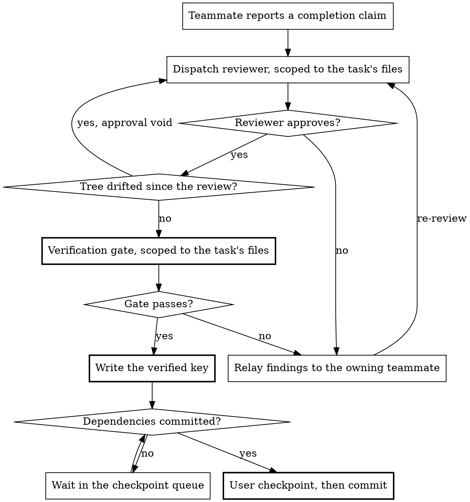

# Orchestrated Implementation

Implement an approved design by decomposing it into ordered, file-disjoint tasks on a shared task board, then running every task that is ready to run across persistent teammates, with the lead holding review, verification, commits and user checkpoints throughout.

The iron laws that bind every teammate and every coordination step (peer isolation, no concurrent writers, exclusive per-task file ownership, board-lag reconciliation, dead-teammate handling) live in `../../rules/common/teammates.md`, with the universal laws shared with one-shot subagents (worktree ban, privilege ban, git ownership, model identifiers) in Part A of `../../rules/common/subagents.md`. The procedural rules for constructing a dispatch (agent type, model selection, parallel dispatch, escalation) live in `../_shared/subagent-dispatch.md`. The rule that implementation requires an approved design lives in `../../rules/common/workflow.md`.

Before running the procedure below, read `../_shared/subagent-dispatch.md` with the Read tool if you have not already read it this session. Read `./teammate-protocol.md` before spawning any teammate: it holds the mailbox contract, the completion handoff, idle handling and failure recovery, and a lead that reaches Spawn and Assign without it is coordinating from memory.

## When to Run

You need an approved design, from the `brainstorming` router via any of its modes, from `work-on-ticket`, or from a committed specification. If the design is incomplete, return to brainstorming rather than running this skill: decomposition cannot invent requirements the design never settled.

Coupled and strictly ordered work runs here too. Order is expressed as `blockedBy` edges between tasks, not as a reason to look for a different skill.

## Process Overview

1. Check both capability preconditions
2. Ask the commit preference, once
3. Run `complexity-triage`, and hand off to `fast-path-implementation` on a SIMPLE verdict
4. Decompose the design into tasks and create the board
5. Run the pre-flight ownership check over the whole decomposition
6. Spawn teammates up to the ready count and assign their tasks
7. On each completion claim, run code review, then the verification gate
8. Drain verified tasks through the user checkpoint, one at a time, in board order
9. Shut every teammate down, run the final feature-level review, report completion

## Capability Gate

Two preconditions. Check both here, before anything else, and check nothing that spawns or writes:

- **The task board.** Confirm `TaskCreate` is available, per the Capability Probe in `../_shared/task-board.md`. There is no flat-checklist fallback: a bullet list carries no `owner`, no `blockedBy`, and none of the `metadata` authority split the run depends on.
- **Teammates.** Confirm the Agent Teams capability is present.

Both checks are free and stateless. The real spawn attempt is not a gate check and stays where it belongs, at spawn time.

Report a failure by naming which precondition failed. "The board tooling is unavailable" and "the teammate capability is not enabled" are different problems with different remedies, and `../../rules/common/errors.md` requires the remedy to be actionable. State what was attempted, what is missing, and that nothing has been written to the board or the tree.

A failed precondition stops the run. It does not select a different way of working.

## Commit Preference

Ask the user once, with `AskUserQuestion`, how commits should be handled. The choice is session-wide and covers every task, including a hand-off to `fast-path-implementation`.

- **Auto-commit after each task**: each verified task is committed as it drains, in board order. The user sees a summary, the scoped diff and the verification evidence for each, and is not asked to confirm.
- **Ask me each time**: each verified task waits for the user's answer before it commits. Teammates keep working while it waits, so more than one task may be queued behind the question.

State the consequence inside the option text, as above. A user choosing "ask me each time" and then stepping away returns to a queue, and that is a property of the choice rather than a surprise to discover three tasks in.

## Triage and Path Selection

Run `complexity-triage` against the approved design. That skill presents its own evidence table and defines what it returns; do not present the table again, and do not re-run triage against the tasks the next section produces.

- **SIMPLE, both preconditions passed.** Invoke `fast-path-implementation` and stop. Pass the evidence table through, and note the override if the SIMPLE verdict came from the user rather than the criteria.
- **SIMPLE, a precondition failed.** The fast path holds no task board and spawns no teammate, so it can still complete. Say so before dispatching anything: name the missing capability, say that reclassification would need it, and let the user choose whether to proceed on that basis.
- **COMPLEX, both preconditions passed.** Continue to Task Decomposition below.
- **COMPLEX, a precondition failed.** Stop, with nothing written to the board and nothing in the tree.

### Re-Entry After The Fast Path Hands Back

`fast-path-implementation` returns `TRIAGE_INVALID` when the actual code falsifies the SIMPLE verdict. Its Return Contract sends the work back here, and the re-entry point is **Task Decomposition** below, not the top of this skill. The commit preference was asked once and holds. `complexity-triage` is not re-run: its Preconditions bind triage to once per design, and the same design against the same predictive evidence returns the same verdict. Take COMPLEX as given, along with the criterion the fast path named.

The fast path settles what happens to its uncommitted partial work with the user before handing back, so arrive at decomposition knowing whether those edits are still in the tree, and plan the file structure against the tree as it actually is.

If the work arrived on the SIMPLE-with-a-failed-precondition branch, decomposition cannot start, because the capability it needs is still missing. Put the position to the user with the COMPLEX verdict in hand: they can stop here, leaving the reviewed but uncommitted work in the tree, or supply the missing capability, in which case re-check that precondition and continue to decomposition if it now passes.

## Task Decomposition

Decompose the design into implementable tasks before creating the board or spawning anything.

### File Structure

Map out which files will be created or modified and what each is responsible for. Lock these decisions in before any code is written. Each file gets one clear responsibility with a well-defined interface, per `../../rules/common/code-organisation.md`. In existing codebases, follow established patterns; files that change together live together.

### Task Granularity

Each task is a self-contained unit of work that produces working, testable code:

- Touches a focused set of files, ideally one to three
- Has acceptance criteria derivable from the design
- Can be verified independently of every other task

Within a task, teammates follow the cycle in `../test-driven-development/`. That is communicated in the assignment, not tracked by the lead.

### Task Ordering

Order tasks by dependency, per `../../rules/common/workflow.md`: foundations and infrastructure first, core features next, integration after its dependencies, polish last. Express every ordering constraint as a `blockedBy` edge. An edge is the only place an ordering constraint can live where the board can act on it.

Two tasks need an edge between them whenever they share anything mutable, not only when they share source files. A shared port, a test database, a generated artefact, a lockfile or a cache is as much a collision as a shared file, and the pre-flight check below cannot see any of them.

### Task Board Output

Create a task per work item with `TaskCreate`. The mapping onto the board's fields (`subject`, `description`, `owner`, `status`, `blockedBy`/`blocks`, `metadata`) is defined once in `../_shared/task-board.md`; read it before creating the first task.

Each task carries, in `description` as prose: scene-setting for where it fits in the design, the files it touches and what each is for, and its acceptance criteria. The recommended model sits alongside them or in `metadata`. Pick one concrete model at the Low-cost default tier, resolved per `../_shared/subagent-dispatch.md`, and escalate only with justification.

The lead records each task's exclusive file set in the lead-only `files` metadata key. Record the same ownership map outside the board as well, per that file's Retention section: a purge drops `metadata` mid-run, and the out-of-board copy is what makes that recoverable rather than fatal.

## Pre-Flight Ownership Check

Before spawning any teammate, prove file-disjointness across the **whole decomposition**, not the tasks about to go live:

1. Read every task's `files` set.
2. Assert the sets are pairwise disjoint: no path appears in more than one task's set.
3. Resolve any overlap before anything starts, either by re-splitting the decomposition so the overlapping files fall under a single task, or by serialising the overlapping tasks with a `blockedBy` edge so they never run at the same time.
4. Re-run the check for any task added to the board later.

Checking only the current wave leaves the next wave free to go live against an overlap nobody tested. This is the operational form of the "no concurrent writers" and exclusive-ownership laws in `../../rules/common/teammates.md`: those laws state the invariant, this check proves it holds before any teammate touches the tree.

Shared and aggregator files need naming explicitly: a barrel export, an index, a shared config, a changelog. Assign each to exactly one task's `files` set. A task that only reads a shared file does not own it; a task that writes to it does, and every other task that would touch it is serialised behind that owner.

## Concurrency

Run every task that can safely run. At each scheduling moment the number of live implementer teammates is:

```
min(tasks that are ready, teammates that can accept one)
```

Both terms need pinning, because neither is self-evident. A task is **ready** when every `blockedBy` edge is verified, its `files` set is disjoint from every task in flight, and no teammate is working it. A teammate **can accept** an assignment only when it holds no task; a teammate awaiting its own task's `verified` key cannot. Total live teammates therefore equals those that can accept plus those in their gate window, and can exceed the ready count. That is a correct state, not a clamp violation.

Take that number as soon as it is available. It is a ceiling on live teammates rather than a target to approach gradually: the count rises on its own as `blockedBy` edges clear and the ready set grows, because foundations-first ordering means few tasks are ready at the start.

Do not ask the user for a concurrency figure. If the user states a ceiling unprompted, it holds for the session and is re-applied as tasks unblock.

You **MUST NOT** lower this number on your own initiative. Every reason to run two tasks less concurrently, a shared file, a shared port, a shared test database, a shared generated artefact, is a `blockedBy` edge between those two tasks, applied at decomposition. A constraint expressed as a smaller ceiling is a constraint the board cannot see.

Do not hold teammates back to build confidence. Parallel work is safe because the pre-flight check proved the ready set file-disjoint and serialised everything else behind `blockedBy`, not because the count is small. Nothing observed during the first task changes the disjointness analysis for the second; the check already covered both.

No number caps this. A refused spawn is a resource limit discovered at spawn time, handled under Failure Handling.

The per-task reviewer is a one-shot subagent, not an implementer teammate, and never counts against this number.

Maximum concurrency shortens the time for tasks to reach a completed claim. It does not shorten the drain, which is serial by design.

## Spawn and Assign

Spawn each teammate as `general-purpose`, resolving its model exactly as a one-shot subagent's, both per `../_shared/subagent-dispatch.md`. Only the lifecycle differs: spawned once, kept alive across tasks. Agent type matters more than usual here, because a teammate that cannot use `SendMessage` cannot be assigned a task, ask a question, or report a claim.

Teammates persist. A teammate whose task has been verified is reassigned the next ready task rather than respawned, and a new teammate is spawned only when a ready task has no teammate free to take it.

Assignment is lead-assign only. The lead sets the task's `owner` and delivers the assignment over SendMessage, per `./teammate-protocol.md`. Self-claiming is forbidden, and the assignment says so explicitly, because the teammate's own tooling invites it.

State the count at each spawn round as a fact rather than a question: how many teammates are starting, and how many tasks are ready. It is a statement, so it never blocks.

## Handling Teammate Reports

A teammate reports one of four statuses. The lead's response to each:

| Status               | Response                                                                                                                                                                    |
|----------------------|-----------------------------------------------------------------------------------------------------------------------------------------------------------------------------|
| `DONE`               | Proceed to code review.                                                                                                                                                     |
| `DONE_WITH_CONCERNS` | Read the concerns. Correctness or scope concerns go into the reviewer's dispatch as something to check. Observations are noted and carried to the checkpoint. Then review.  |
| `NEEDS_CONTEXT`      | Answer completely, per `../_shared/subagent-dispatch.md`, and let the teammate continue. Never rush it back to work with the question unanswered.                           |
| `BLOCKED`            | Assess the blocker. Supply missing context, split the task, or escalate the model. If the design itself is wrong, stop and surface it per `../../rules/common/workflow.md`. |

Escalating a teammate's model is not a re-dispatch; see `./teammate-protocol.md`'s Failure Recovery for what it actually requires.

A mid-task clarifying exchange between a teammate and the lead is lead-internal. It **MUST NOT** surface to the user as a second design approval, and **MUST NOT** expand scope beyond the one approval the design already has.

## Per-Task Review and Verification

A teammate reporting done is a claim pending review and verification, nothing more. On each claim the lead runs two gates, in order.

**Code review, advisory.** Dispatch a one-shot reviewer subagent against `../_shared/code-reviewer-prompt.md`, type and model per `../_shared/subagent-dispatch.md`, scoped to the working-tree diff of the task's declared `files`. This call site fills the Scope block, naming the task's declared files, not the Triage Re-Check block. This reviewer owns no files, holds no board state, is never assigned board work, and needs no shutdown. Its verdict never substitutes for the verification gate. On rejection, relay the findings over SendMessage to the same owning teammate, which still owns the files and still holds the context. Every fix re-enters at code review: unreviewed code must never reach the verification gate.

An Approved verdict carrying only Minor findings does not round-trip to the teammate: those findings are carried forward, unfixed, to the user checkpoint as deferred Minor issues, the same as any other Minor finding.

When several claims arrive together, issue their reviewer dispatches in a single message, per the Parallel Dispatch section of `../_shared/subagent-dispatch.md`. Parallelism comes from the message, not the intent, and this is the single highest-leverage thing the lead can do to shorten every teammate's gate window at once.

**Verification gate, authoritative.** Only after the reviewer approves, and scoped to the same `files`:

1. **Inspect the diff.** Run `git status` and `git diff` scoped to the task's `files`. Confirm the changed files match the task spec and nothing else in that set changed.
2. **Confirm the TDD evidence.** The report **MUST** carry RED to GREEN evidence per `../_shared/implementer-prompt.md`. If it does not, send it back for the missing evidence rather than waving it through.
3. **Re-run the verification commands yourself**, in this message, against the current tree. Do not rely on the teammate's claimed results. Where the task named no commands, run the project's standard test command for the affected scope.
4. **Read the output.** Capture exit codes and pass/fail counts. The output is the evidence.
5. **Compare to the spec.** Does the diff match? Did every command pass? Does the evidence cover every new behaviour in the diff?

If the working tree has drifted from the diff the reviewer saw, the approval is void: re-review before verifying. If any check fails, relay the specific failure to the owning teammate and re-run both gates after the fix. Do not patch it yourself: `../_shared/subagent-dispatch.md` forbids repairing a delegated agent's output in the lead's context.

Only after the gate passes does the lead write the lead-only `verified` key, and `commit_sha` once committed, plus `base_sha` for the next task. Review state is not a board field: it is the seam between `status: completed` and `verified`. A completed-but-unverified task still owes both gates.



## Checkpoint Queue

Implementation runs in parallel. Verified tasks drain through the user checkpoint one at a time, in deterministic order: topological by `blockedBy`, ties broken by index in the original decomposition. Never drain in completion order. Determinism is a safety property here, not a nicety: the same design must produce the same sequence of questions regardless of which teammate happened to finish first.

A task commits only once its `verified` key is written and every `blockedBy` dependency has already been committed. A task that finishes early with an uncommitted dependency waits.

The drain does not gate implementation. A teammate is freed by `verified`, which is written before the checkpoint, so teammates keep working while a checkpoint waits on the user.

For each drained task, present:

1. What was implemented, and what the reviewer found
2. The verification evidence: commands run, exit codes, pass/fail counts
3. The TDD RED to GREEN evidence from the teammate's report
4. A `git diff` **scoped to the task's declared `files`**
5. Which task in board order is draining, and how many verified tasks are queued behind it

The scoping in step 4 is not presentation polish. Several teammates are writing one tree, so an unscoped diff shows the user other tasks' in-flight, unreviewed, unverified work as though it were the task they are approving. Step 5 matters because a task can sit verified and uncommitted waiting for a dependency, and without the queue shown that reads as a stall.

Then commit, or ask first if the user chose to be asked, with options "Commit", "Adjust first" and "Skip commit". Commits are scoped to the task's `files` for the same reason the diff is.

The user is asked once for the commit preference, once per drained task, and once at the final report. Nothing else in this skill asks them anything.

## Shared-Tree Execution Safety

Teammates share one working tree with no per-teammate isolation, per `../../rules/common/teammates.md`. Concurrent test and build runs can contend for the same port, cache, test database, generated artefact or lockfile even when two tasks' source files are disjoint.

Two tasks are safe to run at the same time only if they share no files **and** no mutable test or build state. Contention on either is resolved at decomposition, with a `blockedBy` edge, so the ready set never contains two tasks that would collide.

During implementation, teammates run only their own owned, scoped tests. The authoritative runs stay with the lead: the per-task scoped gate above, and the single full-suite run against the merged tree in the final review.

## Failure Handling

Every failure reduces to the same shape: stop trusting unverified state, re-queue the task against its original specification, and let a fresh teammate pick it up under the lead's gates. Never invent a new specification to route around a failure, and never proceed on unverified work. The per-teammate paths are in `./teammate-protocol.md`.

Two cases belong to the run as a whole:

- **A spawn is refused.** Continue with the teammates that are live. The count is a ceiling, not a floor, and fewer concurrent tasks is strictly safer against file collision than more. Every live teammate is still under the same pre-flight with the same exclusive ownership, so nothing about the safety analysis changes. You **MUST NOT** re-derive the decomposition to fit however many teammates spawned; that is inventing a new specification to route around a failure.
- **No teammate can be live.** The run stops without retrying. Leave the board as it stands, with `verified` and `commit_sha` intact on the tasks that earned them, and tell the user which tasks completed, which did not, and what remains uncommitted in the tree.

A lead crash is unrecoverable. The lead holds the only authoritative verification and commit state, and teammates cannot resume a session on their own. Only work verified and committed before the crash is durable.

## Final Feature-Level Review

Once every task has drained, shut every teammate down first, per `./teammate-protocol.md`, so the review runs against a settled tree with no in-flight writers. Run the reconciliation sweep from that file before claiming anything is complete: board status lags reality.

1. **Invoke `requesting-code-review`** for the feature as a whole. It establishes its own range from the `base_sha` recorded for the first task, dispatches the reviewer, and owns the fix-and-re-review loop until no Critical or Important issue remains. Do not run that loop here. This is the production-readiness review `../../rules/common/code-review.md` requires; the per-task reviews do not replace it, because each saw one task and integration gaps only appear across task boundaries.
2. **Branch on its Return Contract.** Approved brings deferred Minor issues back with it: log them in the completion report. Issues outstanding is a stop, not a verdict to re-litigate; where closing them needs implementation work, re-queue the affected task, run its gates again, then invoke `requesting-code-review` afresh. Nothing to review or Range unknown means a precondition failed and the mandatory review has not happened.
3. **Run `verification-before-completion`** against the feature range: the full test suite, the linter, the build, and anything the design called out. Cite the output.
4. **Report completion**: tasks completed, the review verdict, the verification commands and their output, and any deferred Minor issues.

You **MUST NOT** report the feature complete without steps 1 and 3 having run in this message, with step 1 returning Approved. The per-task gates verified each task in isolation; only a fresh feature-level run satisfies `../../rules/common/verification.md` for the feature claim.

## Worked Example

```
Design approved: five tasks. Commit preference: ask me each time.
Triage: COMPLEX. Board created, files sets recorded, pre-flight passes.

Ready set is task 1 alone (tasks 2 to 5 all blockedBy it).
"Starting 1 teammate; 1 task ready."

Task 1 verified and committed. Tasks 2, 3 and 4 unblock together, task 5 blockedBy 4.
"Starting 2 more teammates; 3 tasks ready." Three live, one per ready task.

Task 3 claims done first, then task 2. Both reviewers dispatched in one message.
Task 3's reviewer rejects: a missing acceptance criterion. Findings relayed to the
teammate that still owns task 3's files. It fixes, re-reports, re-review passes.

Task 2 verified first, so task 2 drains first: it is earlier in board order.
Checkpoint shows task 2's scoped diff, its evidence, and "1 verified task queued".
User commits. Task 3 drains next, then task 4.

Task 5's teammate stops responding mid-task. Its claim heartbeat goes stale, the lead
reclaims the task, sets owner back to "lead", inspects the partial edit scoped to
task 5's files, and re-queues it. A free teammate picks it up against the same spec.

All five drained. Every teammate shut down. Reconciliation sweep confirms the board
matches the tree. requesting-code-review returns Approved with two Minor issues
deferred. verification-before-completion runs the full suite, the linter and the
build, and the output is cited in the completion report.
```

## Common Mistakes

| Mistake                                                                          | Why it is wrong                                                                                                       |
|----------------------------------------------------------------------------------|-----------------------------------------------------------------------------------------------------------------------|
| Draining in completion order rather than board order                             | Two teammates finishing in any order must not change what the user is asked, or when.                                 |
| Treating board `status: completed` as verified                                   | The board is advisory. Only the lead-only `verified` key means a task is done.                                        |
| Assigning a teammate its next task before its current task is verified           | The teammate could drift the diff the reviewer already approved, and the fix round-trip loses the agent that owns it. |
| Showing an unscoped `git diff` at the checkpoint                                 | It presents other teammates' unreviewed, unverified work as part of the task under approval.                          |
| Lowering concurrency instead of adding a `blockedBy` edge                        | A constraint expressed as a ceiling is invisible to the board and disappears the moment the ceiling is raised.        |
| Re-deriving the decomposition to fit however many teammates spawned              | That is inventing a new specification to route around a resource failure.                                             |
| Spawning before the pre-flight ownership check passes                            | The check is the only thing standing between the run and concurrent writers on one file.                              |
| Running the pre-flight over the current wave rather than the whole board         | The next wave then goes live against an overlap nobody tested.                                                        |
| Letting a teammate run the full suite                                            | Concurrent full-suite runs contend on one shared tree. The authoritative run is the lead's, in the final review.      |
| Dispatching the implementer brief with its ownership and reporting block removed | A teammate with no declared `files` and no reporting channel edits other tasks' files and reports where nobody reads. |
| Refusing coupled work instead of serialising it                                  | Ordering is a `blockedBy` edge. There is nowhere else for such work to go.                                            |
| Surfacing a teammate's clarifying question as a second design approval           | It is a lead-internal exchange, not a new user-facing decision point.                                                 |
| Retrying or skipping a capability probe                                          | The gate runs first and once. A failed precondition stops the run rather than selecting another way of working.       |

## Prompt Templates

- `../_shared/implementer-prompt.md`: the brief a teammate works from
- `../_shared/code-reviewer-prompt.md`: the reviewer prompt; the per-task dispatch fills its Scope block

## Integration

- **brainstorming** and its mode skills: produce the design this skill implements
- **work-on-ticket**: recovers design context from tickets in new sessions and feeds it here
- **complexity-triage**: classifies the design before decomposition
- **fast-path-implementation**: receives SIMPLE work handed off from here
- **test-driven-development**: the cycle every teammate follows within a task
- **requesting-code-review** and **verification-before-completion**: the final feature-level gates
- **`./teammate-protocol.md`**: lead-assignment, the mailbox, completion handoff, idle handling, failure recovery
- **`../_shared/task-board.md`**: the board schema this skill's tasks are created and updated against
