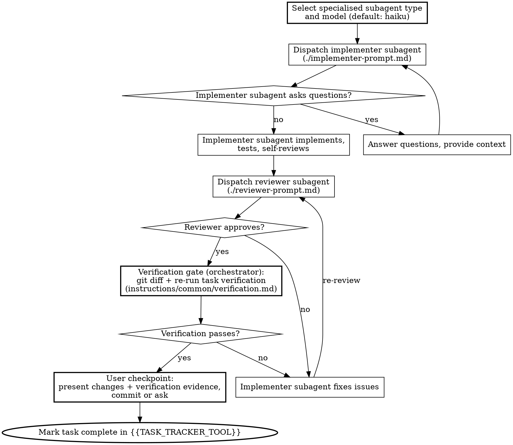

# Subagent-Driven Development

Implement an approved design by decomposing it into ordered tasks, then executing each task with an isolated subagent plus a combined review and a user checkpoint.

The rules on subagent dispatch, context isolation, git ownership, worktrees, model selection, and process discipline live in `instructions/common/subagents.md` and apply throughout this skill. The rule that implementation requires an approved design lives in `instructions/common/workflow.md`.

## When to Run

You need an approved design (from the `brainstorming` router via any of its modes, from `work-on-ticket`, or from a committed specification) whose tasks are mostly independent of each other. If the work is tightly coupled or the design is incomplete, return to brainstorming instead of running this skill.

## Process Overview

1. Ask the commit preference (once, at the start of the session)
2. Run `complexity-triage` against the design
3. If SIMPLE: hand off to `fast-path-implementation` and stop
4. If COMPLEX: decompose into tasks and execute the per-task pipeline for each
5. When all tasks are complete, run the final feature-level review and verification, then report completion

## Commit Preference

Before any further work, ask the user how commits should be handled using `{{ASK_USER_QUESTION_TOOL}}`:

- **Auto-commit after each task**: the orchestrator commits automatically after each task passes review. The user sees a summary of the changes but is not asked whether to commit.
- **Ask me each time**: the orchestrator pauses after each task and asks whether to commit.

Ask this once. The choice applies to every task in the session, including any fast-path handoff. If the user chose auto-commit, per-task checkpoints still show a summary of the changes but skip the commit question.

## Triage and Path Selection

Run `complexity-triage` against the approved design. Present the evidence table to the user.

- If the classification is **SIMPLE**, invoke `fast-path-implementation` and stop. That skill owns the rest of the flow.
- If the classification is **COMPLEX**, continue with the task decomposition below.

## Task Decomposition

Decompose the design into implementable tasks before dispatching any subagent.

### File Structure

Map out which files will be created or modified and what each file is responsible for. Lock these decisions in before any code is written. Each file should have one clear responsibility with a well-defined interface (see `instructions/common/code-organisation.md`). In existing codebases, follow established patterns; files that change together should live together.

### Task Granularity

Each task is a self-contained unit of work that produces working, testable code:

- Touches a focused set of files (ideally 1-3)
- Has clear acceptance criteria derivable from the design
- Can be verified independently of other tasks

Within each task, implementers follow the TDD cycle in `skills/test-driven-development/`. That detail is communicated in the implementer's dispatch, not tracked by the orchestrator.

### Task Ordering

Order tasks to respect dependencies:

1. Foundation and infrastructure first
2. Core features next
3. Integration after dependencies
4. Polish and clean-up last

Tasks execute sequentially in this order. If two tasks have no dependency between them, their relative order is arbitrary, but they still run one at a time.

### Task Tracker Output

Produce a `{{TASK_TRACKER_TOOL}}` with every task. Each entry includes:

- Task name and description
- Recommended subagent type (selected per `instructions/common/subagents.md`)
- Recommended model (default `haiku`, escalate only with justification)
- Files to create or modify (exact paths)
- Acceptance criteria
- Dependencies on other tasks
- Scene-setting context describing where this task fits in the overall design

## Per-Task Pipeline

Execute tasks sequentially. Each task follows the same pipeline.



## Verification Gate

After the reviewer approves and **before** the user checkpoint, the orchestrator **MUST** run the verification gate against the implementer's work. This is the "trust but verify" step that `instructions/common/verification.md` requires when accepting any subagent's success report. The reviewer reads the code; the orchestrator confirms the artefacts.

The procedure is the gate function from the `verification-before-completion` skill, applied to the per-task scope:

1. **Inspect the diff yourself.** Run `git status` and `git diff` (or `git diff <task-base-sha>..HEAD` if the task has a known base). Confirm the files changed match the files the task spec named, and nothing else changed.
2. **Confirm the implementer's TDD evidence.** The implementer's report **MUST** contain RED to GREEN evidence per `./implementer-prompt.md`. If it does not, re-dispatch the implementer with a request for the missing evidence, you **MUST NOT** wave it through.
3. **Re-run the verification commands yourself.** Run the test command, the linter, the build, whatever the task's acceptance criteria require, yourself, in this message, against the current working tree. Do NOT rely on the implementer's claimed test results. If the task spec did not name specific verification commands, run the project's standard test command.
4. **Read the output.** Capture exit codes and pass/fail counts. The output is the evidence.
5. **Compare to the spec.** Does the diff match the task spec? Did the verification commands all pass? Does the TDD evidence cover every new behaviour in the diff?

If any check fails, re-dispatch the implementer with the specific failure as fix instructions and re-run the gate after the fix. Do **not** patch the issue manually in the orchestrator context, that pollutes context and defeats the isolation rules in `instructions/common/subagents.md`.

The gate output (commands run, exit codes, pass/fail counts) is shown to the user as part of the user checkpoint, alongside the diff. "The reviewer said it was fine" is not a substitute for the gate.

## User Checkpoint

After the verification gate passes, present the work to the user:

1. Summarise what was implemented and what the reviewer found
2. Cite the verification evidence: the commands you ran, their exit codes, the pass/fail counts
3. Cite the implementer's TDD RED to GREEN evidence
4. Show a `git diff` of the uncommitted changes

If the user chose "ask me each time":

5. Use `{{ASK_USER_QUESTION_TOOL}}` to ask whether to commit (options: "Commit", "Adjust first", "Skip commit")
6. Only commit when the user confirms
7. Proceed to the next task

If the user chose auto-commit:

5. Commit immediately after presenting the summary
6. Proceed to the next task

The checkpoint summary exists regardless of commit preference. The commit question is the part conditional on the upfront choice. The verification evidence is non-optional, without it, you have not satisfied `instructions/common/verification.md`.

## Handling Implementer Status

Implementer subagents report one of four statuses:

- **DONE**: proceed to review
- **DONE_WITH_CONCERNS**: read the concerns. If they are about correctness or scope, address them before review. If they are observations ("this file is getting large"), note them and proceed to review.
- **NEEDS_CONTEXT**: provide the missing information and re-dispatch
- **BLOCKED**: assess the blocker. If it is context, re-dispatch with more context. If it is a reasoning-capacity problem, re-dispatch with a more capable model. If the task is too large, break it into smaller pieces. If the plan itself is wrong, stop and surface to the human per `instructions/common/workflow.md`.

The rules in `instructions/common/subagents.md` forbid ignoring an escalation or forcing the same model to retry without changing anything.

## Final Feature-Level Review

After the per-task pipeline has been run for every task in the decomposition and every task has been committed or set aside per the user's preference, you **MUST** run a final feature-level review against the cumulative work range before reporting the feature complete. The per-task reviewers see one task at a time; the final review sees the feature as a whole and catches issues that only emerge across task boundaries (inconsistent naming, drifting interfaces, integration gaps, leaked test scaffolding).

The procedure:

1. **Identify the feature range.** Capture the base commit (the parent of the first task's first commit, or the commit at session start) and the head commit (current `HEAD`).
2. **Invoke `requesting-code-review`** against that range. The skill dispatches a `code-reviewer` subagent (or a more specific reviewer per `instructions/common/subagents.md`) using `skills/requesting-code-review/code-reviewer.md`. This is the production-readiness review mandated by `instructions/common/code-review.md`; the per-task reviews do not replace it.
3. **Process the reviewer output via `receiving-code-review`.** Apply severity discipline per `instructions/common/code-review.md`:
   - **Critical** issues: stop, fix before reporting completion. Re-dispatch the implementer for the affected task scope, re-run the per-task pipeline including the verification gate, and re-run the feature-level review.
   - **Important** issues: same as Critical for orchestrated work, fix before completion.
   - **Minor** issues: log them in the completion report; the user decides whether to address them in this session or later.
4. **Run `verification-before-completion`** against the feature range. The per-task verification gates verified each task in isolation; this final pass verifies the feature as a whole. Run the project's full test suite, the linter, the build, and any feature-specific verification the design called out. Cite the output.
5. **Report completion** with: the list of tasks completed, the feature-level review verdict, the verification commands and their outputs, and any deferred Minor issues.

You **MUST NOT** report the feature complete without steps 2 and 4 having been run in this message. The per-task verification gates do not satisfy `instructions/common/verification.md` for the feature claim; only a fresh feature-level run does.

## Worked Example

```
You: I'm using Subagent-Driven Development to implement this design.

[Ask user: commit preference]
User chose: Ask me each time

[Run complexity-triage]
Classification: COMPLEX
[Evidence table shown]

[Decompose design: map file structure, define 5 tasks with acceptance criteria, order by dependencies]
[Create {{TASK_TRACKER_TOOL}} with all tasks, each annotated with subagent type and model: haiku]

Task 1 (model: haiku):

[Dispatch implementer]

Implementer: "Before I begin: should the hook be installed at user or system level?"

You: "User level (~/.config/hooks/)"

Implementer: "Got it. Implementing now."
[Later] Implementer:
  - Implemented install-hook command
  - Added tests, 5/5 passing
  - Self-review: found I missed the --force flag, added it

[Dispatch reviewer]
Reviewer: [PASS] Spec compliant, code quality good. Clean implementation, good test coverage.

[Verification gate: orchestrator runs git diff + test command itself]
$ git diff --stat
 src/install-hook.ts | 47 ++++++++
 src/install-hook.test.ts | 62 ++++++++++++++
 2 files changed, 109 insertions(+)
$ npm test src/install-hook.test.ts
PASS src/install-hook.test.ts (5 tests, 5 passed)
$ npm run typecheck
exit 0

[Verification PASSES]

[Present diff + verification evidence to user]
Task 1 complete: install-hook command with --force flag.
Tests: 5/5 passing (npm test src/install-hook.test.ts, exit 0)
Typecheck: exit 0
TDD evidence (from implementer): "installs hook at user level" RED -> GREEN, "respects --force flag when target exists" RED -> GREEN, ...

[Ask: Commit / Adjust first / Skip commit]
User: Commit

[Commit, mark Task 1 complete]

Task 2 (model: haiku):

[Dispatch implementer]

Implementer:
  - Added verify/repair modes
  - 8/8 tests passing
  - Self-review: all good

[Dispatch reviewer]
Reviewer: [FAIL] Issues:
  - Missing: progress reporting (spec says "report every 100 items")
  - Extra: added --json flag (not requested)
  - Magic number (100) should be a named constant

[Re-dispatch implementer with fix instructions (model: haiku)]
Implementer: Removed --json flag, added progress reporting with PROGRESS_INTERVAL constant

[Reviewer reviews again]
Reviewer: [PASS] Spec compliant now, quality good.

[Present diff to user]
Task 2 complete: verify/repair modes with progress reporting. 8 tests passing.
The reviewer caught a missing requirement and an extra flag on the first pass, both fixed.

[Ask: Commit / Adjust first / Skip commit]
User: Commit

[Commit, mark Task 2 complete]

Tasks 3-5 follow the same pipeline.

[All 5 tasks complete. Final feature-level review begins.]

[Invoke requesting-code-review against BASE..HEAD for the whole feature]
Reviewer: [Critical] none. [Important] one issue: error messages from install-hook do not include the path that failed. [Minor] two style issues.

[Important issue must be fixed before completion. Re-dispatch implementer for Task 1 scope to address the error message issue. Re-run per-task pipeline for Task 1 including verification gate. Re-run feature-level review.]
Reviewer: [Critical] none. [Important] none. [Minor] two style issues (deferred).

[Invoke verification-before-completion against the feature]
$ npm test
PASS (78 tests, 78 passed)
$ npm run lint
exit 0
$ npm run build
exit 0

[Report feature complete with evidence and 2 deferred Minor issues]

Done.
```

## Prompt Templates

- `./implementer-prompt.md`: dispatch implementer subagent for any task (shared with `fast-path-implementation`)
- `./reviewer-prompt.md`: dispatch combined reviewer subagent for per-task review

## Integration

- **brainstorming** (and its mode skills `brainstorming-standard`, `brainstorming-guided`, `brainstorming-committee`, `brainstorming-skip`): produces the design this skill implements
- **work-on-ticket**: recovers design context from tickets in new sessions and feeds it into this skill
- **complexity-triage**: invoked at the start to classify the work
- **fast-path-implementation**: receives SIMPLE work handed off from this skill
- **test-driven-development**: the cycle every implementer subagent follows for each task
- **requesting-code-review**: for the code review prompt used by reviewer subagents
