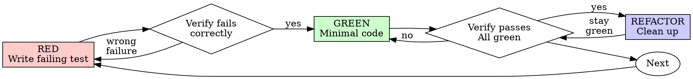

# Test-Driven Development

This skill executes the red-green-refactor cycle. The iron-law rules (the iron law itself, when TDD applies, the verification requirement, YAGNI during GREEN, good-test criteria) live in `../../rules/common/testing.md` and apply throughout. The procedural rules that bind once this skill is running (the rationalisation table, the red-flags stop list) live in `RULES.md` alongside this file.

Before running the cycle below, you **MUST** read `RULES.md` (sibling file in this skill directory) using the Read tool if you have not already read it in this session.

## The Cycle



## RED: Write a Failing Test

Write one minimal test that expresses the behaviour you want. Name it as a complete phrase describing the behaviour. Exercise real code.

<Good>
```typescript
test('retries failed operations 3 times', async () => {
  let attempts = 0;
  const operation = () => {
    attempts++;
    if (attempts < 3) throw new Error('fail');
    return 'success';
  };

  const result = await retryOperation(operation);

  expect(result).toBe('success');
  expect(attempts).toBe(3);
});
```
</Good>

<Bad>
```typescript
test('retry works', async () => {
  const mock = jest.fn()
    .mockRejectedValueOnce(new Error())
    .mockRejectedValueOnce(new Error())
    .mockResolvedValueOnce('success');
  await retryOperation(mock);
  expect(mock).toHaveBeenCalledTimes(3);
});
```
Vague name, and it tests the mock rather than the code under test.
</Bad>

## Verify RED: Watch It Fail

Run the test:

```bash
npm test path/to/test.test.ts
```

Confirm:

- The test fails (it does not error)
- The failure message is the one you expected
- The failure is because the feature is missing, not because of a typo or import error

If the test passes, you are exercising behaviour that already exists. Fix the test.
If the test errors, fix the error and re-run until the test fails for the right reason.

## GREEN: Minimal Code to Pass

Write the simplest code that makes the test pass.

<Good>
```typescript
async function retryOperation<T>(fn: () => Promise<T>): Promise<T> {
  for (let i = 0; i < 3; i++) {
    try {
      return await fn();
    } catch (e) {
      if (i === 2) throw e;
    }
  }
  throw new Error('unreachable');
}
```
</Good>

<Bad>
```typescript
async function retryOperation<T>(
  fn: () => Promise<T>,
  options?: {
    maxRetries?: number;
    backoff?: 'linear' | 'exponential';
    onRetry?: (attempt: number) => void;
  }
): Promise<T> {
  // YAGNI
}
```
Over-engineered. The test did not ask for options.
</Bad>

## Verify GREEN: Watch It Pass

Run the test:

```bash
npm test path/to/test.test.ts
```

Confirm:

- The new test passes
- All other tests still pass
- Output is pristine, no warnings, no stray errors

If the new test fails, fix the code, not the test.
If other tests fail, fix them now before continuing.

## REFACTOR: Clean Up While Green

Only once the test is passing:

- Remove duplication
- Improve names
- Extract helpers

Keep every test green throughout. Do not add new behaviour during refactor.

## Repeat

Write the next failing test for the next piece of behaviour.

## Worked Example: Bug Fix

**Bug:** Empty email accepted.

**RED**

```typescript
test('rejects empty email', async () => {
  const result = await submitForm({ email: '' });
  expect(result.error).toBe('Email required');
});
```

**Verify RED**

```bash
$ npm test
FAIL: expected 'Email required', got undefined
```

**GREEN**

```typescript
function submitForm(data: FormData) {
  if (!data.email?.trim()) {
    return { error: 'Email required' };
  }
  // ...
}
```

**Verify GREEN**

```bash
$ npm test
PASS
```

**REFACTOR**
Extract validation for multiple fields if the pattern repeats.

## Completion Gate

Before claiming a cycle complete, confirm every box:

- [ ] Every new function or method has a test
- [ ] You watched each test fail before implementing
- [ ] Each test failed for the expected reason, not a typo or import error
- [ ] You wrote only the minimal code to pass each test
- [ ] All tests pass
- [ ] Output is pristine
- [ ] Tests exercise real code, mocks only at true boundaries
- [ ] Edge cases and error paths covered

If any box is unchecked, you skipped part of the cycle. The rules in `../../rules/common/testing.md` apply.

## When Stuck

| Problem                   | Response                                                                     |
|---------------------------|------------------------------------------------------------------------------|
| Don't know how to test it | Write the wished-for API. Write the assertion first. Ask your human partner. |
| Test is too complicated   | The design is too complicated. Simplify the interface.                       |
| Must mock everything      | Code is too coupled. Use dependency injection.                               |
| Test setup is huge        | Extract helpers. If still complex, simplify the design.                      |

## Testing Anti-Patterns

When adding mocks or test utilities, read `testing-anti-patterns.md` to avoid:

- Testing mock behaviour instead of real behaviour
- Adding test-only methods to production classes
- Mocking without understanding dependencies
