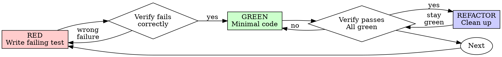

# Test-Driven Development

Executes the red-green-refactor cycle: one failing test, watched failing for the right reason, the minimal code that passes it, then clean-up while everything stays green.

## The Cycle



## RED: Write a Failing Test

Write one minimal test that expresses the behaviour you want. Name it as a complete phrase describing the behaviour. Exercise real code.

<Good>
```typescript
test('retries failed operations 3 times', async () => {
  let attempts = 0;
  const operation = () => {
    attempts++;
    if (attempts < 3) throw new Error('fail');
    return 'success';
  };

  const result = await retryOperation(operation);

  expect(result).toBe('success');
  expect(attempts).toBe(3);
});
```
</Good>

<Bad>
```typescript
test('retry works', async () => {
  const mock = jest.fn()
    .mockRejectedValueOnce(new Error())
    .mockRejectedValueOnce(new Error())
    .mockResolvedValueOnce('success');
  await retryOperation(mock);
  expect(mock).toHaveBeenCalledTimes(3);
});
```
Vague name, and it tests the mock rather than the code under test.
</Bad>

## Verify RED: Watch It Fail

Run the test:

```bash
npm test path/to/test.test.ts
```

Confirm:

- The test fails (it does not error)
- The failure message is the one you expected
- The failure is because the feature is missing, not because of a typo or import error

If the test passes, you are exercising behaviour that already exists. Fix the test.
If the test errors, fix the error and re-run until the test fails for the right reason.

## GREEN: Minimal Code to Pass

Write the simplest code that makes the test pass.

<Good>
```typescript
async function retryOperation<T>(fn: () => Promise<T>): Promise<T> {
  for (let i = 0; i < 3; i++) {
    try {
      return await fn();
    } catch (e) {
      if (i === 2) throw e;
    }
  }
  throw new Error('unreachable');
}
```
</Good>

<Bad>
```typescript
async function retryOperation<T>(
  fn: () => Promise<T>,
  options?: {
    maxRetries?: number;
    backoff?: 'linear' | 'exponential';
    onRetry?: (attempt: number) => void;
  }
): Promise<T> {
  // YAGNI
}
```
Over-engineered. The test did not ask for options.
</Bad>

## Verify GREEN: Watch It Pass

Run the test:

```bash
npm test path/to/test.test.ts
```

Confirm:

- The new test passes
- All other tests still pass
- Output is pristine, no warnings, no stray errors

If the new test fails, fix the code, not the test.
If other tests fail, fix them now before continuing.

## REFACTOR: Clean Up While Green

Only once the test is passing:

- Remove duplication
- Improve names
- Extract helpers

Keep every test green throughout. Do not add new behaviour during refactor.

## Repeat

Write the next failing test for the next piece of behaviour.

## Worked Example: Bug Fix

**Bug:** Empty email accepted.

**RED**

```typescript
test('rejects empty email', async () => {
  const result = await submitForm({ email: '' });
  expect(result.error).toBe('Email required');
});
```

**Verify RED**

```bash
$ npm test
FAIL: expected 'Email required', got undefined
```

**GREEN**

```typescript
function submitForm(data: FormData) {
  if (!data.email?.trim()) {
    return { error: 'Email required' };
  }
  // ...
}
```

**Verify GREEN**

```bash
$ npm test
PASS
```

**REFACTOR**
Extract validation for multiple fields if the pattern repeats.

## Completion Gate

Before claiming a cycle complete, confirm every box:

- [ ] Every new function or method has a test
- [ ] You watched each test fail before implementing
- [ ] Each test failed for the expected reason, not a typo or import error
- [ ] You wrote only the minimal code to pass each test
- [ ] All tests pass
- [ ] Output is pristine
- [ ] Tests exercise real code, mocks only at true boundaries
- [ ] Edge cases and error paths covered

If any box is unchecked, you skipped part of the cycle.

## When Stuck

| Problem                     | Response                                                                       |
|-----------------------------|--------------------------------------------------------------------------------|
| Don't know how to test it   | Write the wished-for API. Write the assertion first. Ask your human partner.   |
| Test is too complicated     | The design is too complicated. Simplify the interface.                         |
| Must mock everything        | Code is too coupled. Use dependency injection.                                 |
| Test setup is huge          | Extract helpers. If still complex, simplify the design.                        |

## Common Rationalisations

You will be tempted to skip TDD. Every excuse below means **recover a genuine RED**:

| Excuse                                        | Reality                                                                         |
|-----------------------------------------------|---------------------------------------------------------------------------------|
| "Too simple to test"                          | Simple code breaks. The test takes thirty seconds.                              |
| "I'll test after"                             | Tests passing immediately prove nothing.                                        |
| "I already manually tested it"                | Manual testing has no record and cannot be re-run.                              |
| "The code is already written"                 | It is unverified. Stash the change, watch RED, restore the change, watch GREEN. |
| "The test is hard to write"                   | Hard to test means hard to use. Fix the design.                                 |
| "I must mock everything"                      | Code is too coupled. Use dependency injection.                                  |
| "TDD will slow me down"                       | TDD is faster than debugging in production.                                     |
| "Existing code has no tests"                  | You are improving it. Add the test.                                             |
| "Just this once" / "this case is different"   | No.                                                                             |

## Red Flags: Stop and Recover RED

If any of the following is true, stop immediately and recover a genuine RED, watching the test fail for the right reason before the code that passes it is accepted. If the production code already exists, stash or disable it until you have watched that failure:

- You wrote code before a test
- A test passed immediately on its first run
- You cannot explain why a test failed
- You are about to say "just this once" or "this case is different"

There are no exceptions without explicit permission from your human partner.

## Testing Anti-Patterns

When adding mocks or test utilities, read `testing-anti-patterns.md` to avoid:

- Testing mock behaviour instead of real behaviour
- Adding test-only methods to production classes
- Mocking without understanding dependencies
